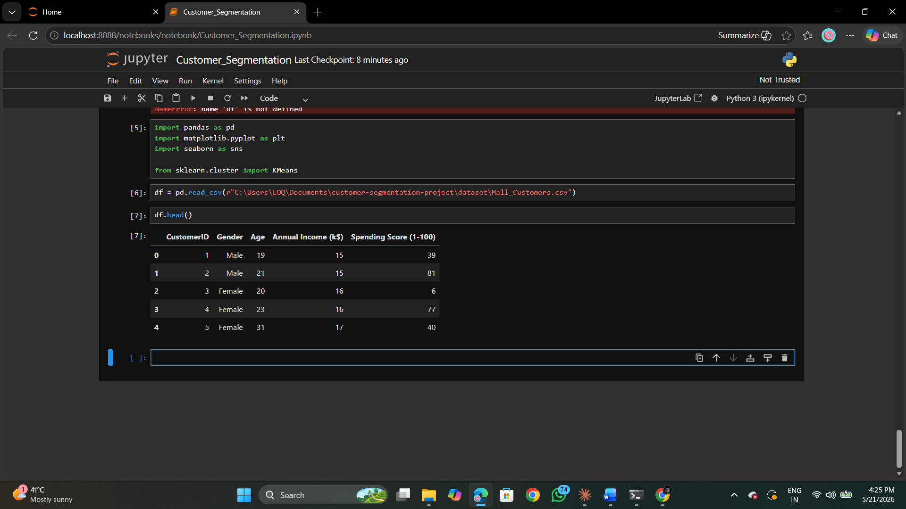
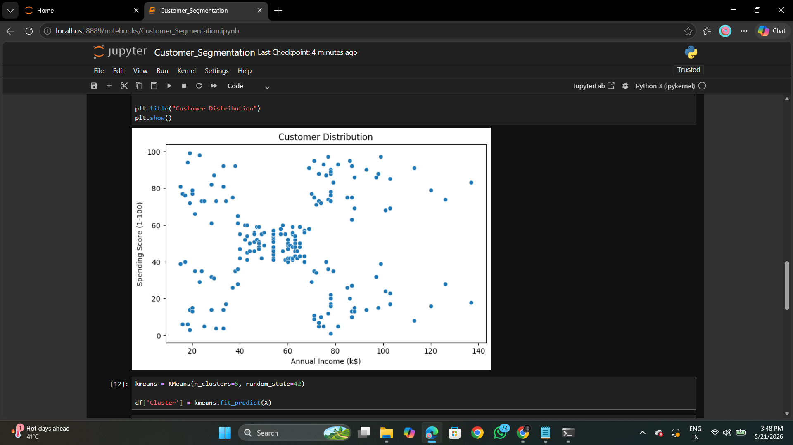

# Customer Segmentation Using Machine Learning

## Project Overview

This project performs customer segmentation using Machine Learning techniques. The K-Means Clustering algorithm is used to divide customers into different groups based on Annual Income and Spending Score.

The project helps businesses identify customer behavior patterns and improve marketing strategies.

---

## Technologies Used

- Python
- Jupyter Notebook
- Pandas
- NumPy
- Matplotlib
- Seaborn
- Scikit-learn

---

## Machine Learning Algorithm

- K-Means Clustering

---

## Dataset

- Mall Customers Dataset

Dataset Features:
- Customer ID
- Gender
- Age
- Annual Income
- Spending Score

---

## Project Workflow

1. Data Loading
2. Data Preprocessing
3. Exploratory Data Analysis
4. Elbow Method
5. K-Means Clustering
6. Cluster Visualization
7. Customer Segment Analysis

---

## Customer Segments Identified

- Premium Customers
- Budget Customers
- Average Customers
- Careful Customers
- Impulsive Customers

---

## Visualizations

### Raw Customer Distribution



---

### Elbow Method


---

### Final Customer Clusters



---

## Results

The model successfully grouped customers into meaningful clusters. Businesses can use these insights for:
- targeted marketing
- customer retention
- personalized recommendations
- strategic decision making

---

## Repository Structure

```bash
customer-segmentation-project
│
├── dataset
├── notebook
├── report
├── screenshots
├── README.md
├── requirements.txt
└── LICENSE
```

---

## Author

Tanishka Rupeshkumar Bellale

B.Tech Computer Engineering  
JSPM RSCOE

---

## License

This project is licensed under the MIT License.
